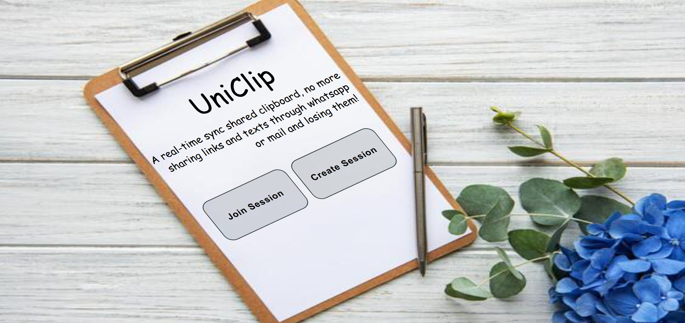
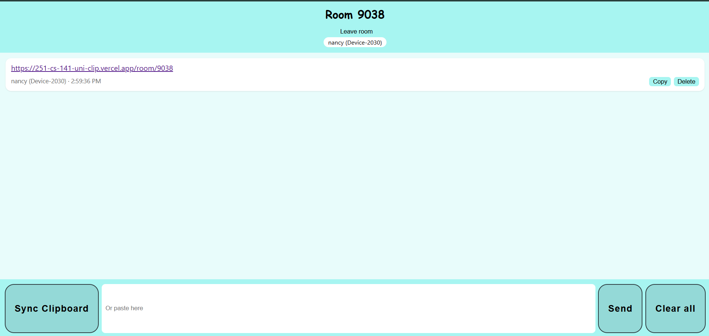

# UniClip

A real-time shared clipboard. Sync text and links between your devices without logging in.

**Live demo:** https://251-cs-141-uni-clip.vercel.app/




---

## About
UniClip lets you sync your clipboard to a website so whatever you copied on one device is available on another device that has joined the same session.
There is no authentication, and sessions are temporary. A device creates a session and gets a random 4-digit code, and other devices pair up by entering that code.

---

## Features
- Create or join a session with a 4-digit code (no login), each device picks a nickname
- Live list of connected devices
- "Sync Clipboard" button to send the current clipboard, with a manual paste box as a fallback
- Links are detected and shown as clickable links, separately from plain text
- Real-time updates with no page refresh, in a consistent order, with duplicate entries blocked
- Clipboard history showing content, device and time, with Copy, Delete and Clear all
- Auto-reconnect, and reloading the page keeps you in the room with your history
- Leave room option

---

## Working

### WebSockets
A normal HTTP request is one question and one answer. A WebSocket keeps a connection open between the browser and the server, so the server can push data to a device whenever something changes. UniClip uses Socket.IO, a library built on WebSockets that adds rooms and automatic reconnection.

### Clipboard API
The browser's Clipboard API (`navigator.clipboard`) is used to read the copied text (`readText`) and to copy an entry back (`writeText`). Browsers don't allow websites to watch the clipboard in the background, so reading happens only when the user clicks "Sync Clipboard", and it needs permission and HTTPS.

### Integration in the project
1. A device creates a session. The server generates a unique 4-digit code and stores an empty session in memory.
2. Other devices join with the code, and the server adds each socket to a Socket.IO room named after the code.
3. Clicking Sync reads the clipboard and sends a `new_entry` event with a unique id. The server rejects duplicates, adds the sender and timestamp, saves it, and broadcasts it to the room.
4. On every reconnect or reload the client re-joins the room, and the server sends the full history, which replaces the client's list so nothing is duplicated.
5. When the last device leaves, the session is deleted (after a short grace period, so a page reload doesn't destroy it).

---

## Setup

### Backend
```bash
cd backend
python -m venv venv
venv\Scripts\activate
pip install -r requirements.txt
uvicorn server:asgi_app --reload --port 8000
```

### Frontend
```bash
cd frontend
npm install
```
Create `frontend/.env`:
```
REACT_APP_BACKEND_URL=http://localhost:8000
```
Then run:
```bash
npm start
```

---

## Tech Stack
- **Frontend:** React, React Router, socket.io-client, HTML, CSS
- **Backend:** Python, FastAPI, python-socketio, Uvicorn
- **Deployment:** Vercel (frontend), Render (backend)

---

## Limitations
- Sessions and history are stored in server memory, so they are lost when the server restarts. On the free hosting tier the server sleeps when idle, and the first connection after a break can be slow.
- Clipboard syncing needs a button click, because browsers block background clipboard monitoring. The Clipboard API also needs HTTPS (localhost is exempt).
- Only the most recent clipboard item is read per sync, not the full OS clipboard history.